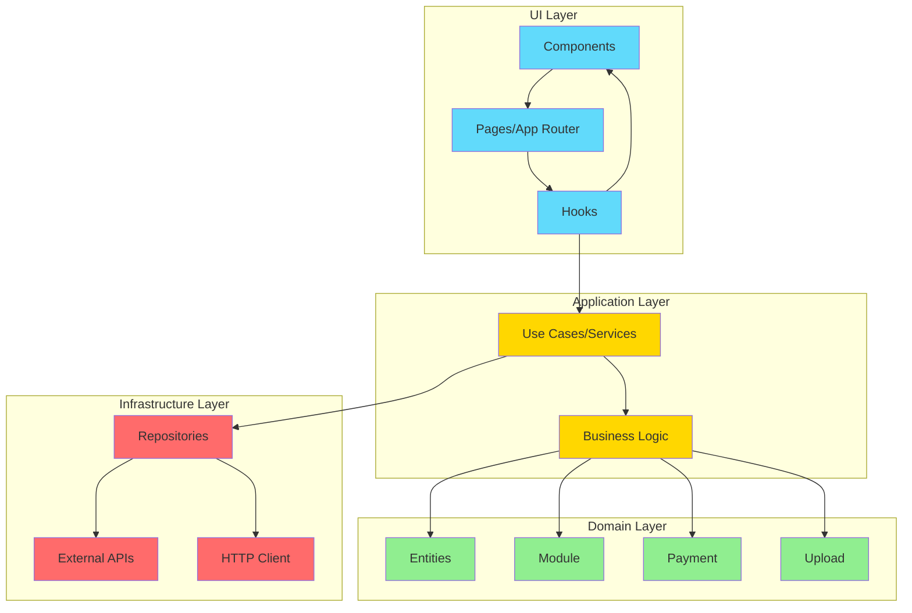
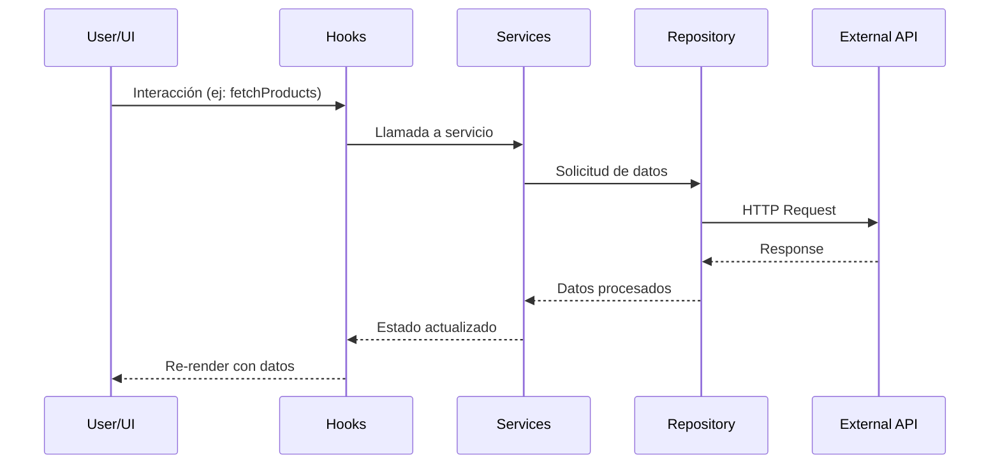

# CreceIdea E-commerce Platform


> Plataforma moderna de gestión de e-commerce construida con Next.js 14, TypeScript y arquitectura limpia. Diseñada para ofrecer una experiencia completa de administración de productos, pedidos, pagos y personalización de tienda online.

---

## 📋 Tabla de Contenidos

- [Acerca del Proyecto](#-acerca-del-proyecto)
- [Características Principales](#-características-principales)
- [Arquitectura](#-arquitectura)
- [Requisitos Previos](#-requisitos-previos)
- [Instalación](#-instalación)
- [Variables de Entorno](#-variables-de-entorno)
- [Ejecución](#-ejecución)
- [Estructura del Proyecto](#-estructura-del-proyecto)
- [Guía de Desarrollo](#-guía-de-desarrollo)
- [Buenas Prácticas Aplicadas](#-buenas-prácticas-aplicadas)
- [Stack Tecnológico](#-stack-tecnológico)
- [Ejemplos de Uso](#-ejemplos-de-uso)
- [Integración con APIs](#-integración-con-apis)
- [Contribuir](#-contribuir)
- [Licencia](#-licencia)
- [Créditos](#-créditos)

---

## 🚀 Acerca del Proyecto

**CreceIdea E-commerce Platform** es una solución integral de gestión de comercio electrónico desarrollada para CreceIdea Perú. La plataforma permite a los comerciantes administrar completamente su tienda online desde un panel de control moderno y responsive.

### ¿Qué hace especial a este proyecto?

- **Arquitectura Limpia**: Implementación de Domain-Driven Design (DDD) con separación clara de capas
- **TypeScript First**: Tipado estricto para mayor confiabilidad y mantenibilidad
- **Next.js 14 App Router**: Aprovecha las últimas características de Next.js con Server Components
- **UI Moderna**: Interfaz construida con NextUI y TailwindCSS con soporte para modo oscuro
- **Extensible**: Sistema de módulos dinámicos para agregar funcionalidades

---

## ✨ Características Principales

### 📊 Dashboard Analítico
- Visualización de métricas clave con gráficos interactivos (Recharts)
- Estadísticas de ventas y productos más vendidos
- Contador de visitas al sitio
- Resumen de pedidos recientes

### 🛍️ Gestión de Productos
- CRUD completo de productos
- Categorización y organización
- Carga de imágenes con compresión automática
- Editor de contenido enriquecido (React Quill)
- Drag & drop para ordenamiento

### 📦 Gestión de Pedidos
- Visualización y seguimiento de pedidos
- Detalles completos de cada orden
- Estados y actualizaciones en tiempo real

### 💳 Métodos de Pago
- Integración con múltiples pasarelas de pago
- Configuración dinámica de métodos de pago
- Sistema de módulos instalables

### 🎨 Personalización
- **Temas**: Modo claro/oscuro con persistencia
- **Branding**: Carga de logo y banners personalizados
- **Colores**: Selector de colores para personalización de marca
- **SEO**: Configuración de meta tags y optimización
- **Redes Sociales**: Gestión de enlaces a redes sociales
- **WhatsApp**: Integración con WhatsApp Business

### 🔐 Autenticación
- Sistema de login seguro con NextAuth.js
- Protección de rutas con permisos
- Gestión de sesiones

### 📱 Responsive Design
- Optimizado para desktop, tablet y móvil
- Sidebar redimensionable
- Detección de dispositivos móviles

---

## 🏗️ Arquitectura

Este proyecto implementa **Clean Architecture** (Arquitectura Limpia) con separación de responsabilidades en capas:



### Flujo de Datos



---

## 📋 Requisitos Previos

Antes de comenzar, asegúrate de tener instalado:

- **Node.js** >= 18.x (recomendado: 20.x LTS)
- **npm** >= 9.x o **yarn** >= 1.22.x
- **Git** >= 2.x

Verificar versiones:

```bash
node --version
npm --version
git --version
```

---

## 📥 Instalación

### 1. Clonar el repositorio

```bash
git clone https://github.com/Yimmi-urbano/creceidea-project-ecommerce.git
cd creceidea-project-ecommerce
```

### 2. Instalar dependencias

```bash
npm install
```

O si prefieres yarn:

```bash
yarn install
```

### 3. Configurar variables de entorno

Crea un archivo `.env` en la raíz del proyecto (ver sección [Variables de Entorno](#-variables-de-entorno)).

---

## 🔐 Variables de Entorno

Crea un archivo `.env` en la raíz del proyecto con las siguientes variables:

| Variable | Descripción | Ejemplo |
|----------|-------------|---------|
| `NEXT_PUBLIC_API_URL_AUTH` | URL de la API de autenticación | `https://dev-api-auth.creceidea.pe/api` |
| `NEXT_PUBLIC_DOMAINS_ASSIGNED` | Endpoint para obtener dominios asignados | `https://dev-api-domain.creceidea.pe/domains/my/domain` |
| `NEXT_PUBLIC_PRODUCTS` | URL de la API de productos | `https://dev-api-products.creceidea.pe/api/products` |
| `NEXT_PUBLIC_CONFIGURATION` | URL de la API de configuración | `https://dev-api-configuration.creceidea.pe/api` |
| `NODE_ENV` | Entorno de ejecución | `development` o `production` |

### Ejemplo de archivo `.env`

```env
NEXT_PUBLIC_API_URL_AUTH=https://dev-api-auth.creceidea.pe/api
NEXT_PUBLIC_DOMAINS_ASSIGNED=https://dev-api-domain.creceidea.pe/domains/my/domain
NEXT_PUBLIC_PRODUCTS=https://dev-api-products.creceidea.pe/api/products
NEXT_PUBLIC_CONFIGURATION=https://dev-api-configuration.creceidea.pe/api
NODE_ENV=development
```

> **⚠️ Importante**: Las variables con prefijo `NEXT_PUBLIC_` son accesibles desde el cliente. No incluyas secretos sensibles en estas variables.

---

## 🚀 Ejecución

### Modo Desarrollo

Inicia el servidor de desarrollo con hot-reload:

```bash
npm run dev
```

La aplicación estará disponible en [http://localhost:3000](http://localhost:3000)

> **💡 Tip**: El proyecto usa Turbopack (`--turbo`) para compilación más rápida en desarrollo.

### Modo Producción

#### 1. Construir la aplicación

```bash
npm run build
```

#### 2. Iniciar el servidor de producción

```bash
npm start
```

El servidor se iniciará en el puerto `3001` (configurable en `package.json`).

### Linting

Ejecutar ESLint para verificar y corregir problemas de código:

```bash
npm run lint
```

---

## 📁 Estructura del Proyecto

```
creceidea-project-ecommerce/
├── app/                          # Next.js 14 App Router
│   ├── configuration/            # Módulo de configuración
│   │   ├── banner/              # Gestión de banners
│   │   ├── colors/              # Personalización de colores
│   │   ├── logo/                # Carga de logo
│   │   ├── seo/                 # Configuración SEO
│   │   ├── social/              # Enlaces sociales
│   │   └── whatsapp/            # Integración WhatsApp
│   ├── dashboard/                # Panel principal
│   │   ├── categories/          # Gestión de categorías
│   │   ├── orders/              # Gestión de pedidos
│   │   └── products/            # Gestión de productos
│   ├── login/                    # Autenticación
│   ├── module/                   # Módulos dinámicos
│   │   └── payment_methods/     # Métodos de pago
│   ├── layout.tsx               # Layout principal
│   ├── page.tsx                 # Página de inicio
│   └── providers.tsx            # Providers globales
│
├── components/                   # Componentes reutilizables
│   ├── category/                # Componentes de categorías
│   ├── home/                    # Componentes del home
│   ├── orderDetails/            # Detalles de pedidos
│   ├── products/                # Componentes de productos
│   ├── user/                    # Componentes de usuario
│   ├── utils/                   # Utilidades UI
│   ├── navbar.tsx               # Barra de navegación
│   ├── sidebar.tsx              # Barra lateral
│   ├── toolbar.tsx              # Barra de herramientas
│   └── theme-switch.tsx         # Selector de tema
│
├── hooks/                        # Custom React Hooks
│   ├── ConfigContext.tsx        # Context de configuración
│   ├── contextProduct.tsx       # Context de productos
│   ├── bannerService.ts         # Servicio de banners
│   ├── colorService.ts          # Servicio de colores
│   ├── fetchOrders.ts           # Hook para pedidos
│   ├── fetchProducts.ts         # Hook para productos
│   ├── formHandlers.ts          # Manejadores de formularios
│   ├── logoService.ts           # Servicio de logo
│   ├── serviceUpdateSeo.ts      # Servicio SEO
│   ├── socialLinksReducer.ts    # Reducer de redes sociales
│   ├── socialsLinksService.ts   # Servicio de redes sociales
│   ├── useIsMobile.ts           # Detección de móvil
│   ├── useIsOrders.ts           # Hook de pedidos
│   ├── useOrderDetails.ts       # Detalles de pedido
│   ├── useResizableSidebar.ts   # Sidebar redimensionable
│   ├── useThemes.ts             # Gestión de temas
│   ├── useUpdateCatalog.ts      # Actualización de catálogo
│   └── useWhatsappHome.ts       # Hook de WhatsApp
│
├── domain/                       # Capa de Dominio (Entidades)
│   ├── installed_modules/
│   │   └── Module.ts            # Entidad Module
│   ├── payments_methods/
│   │   └── Payment.ts           # Entidad Payment
│   └── upload/
│       └── Upload.ts            # Entidad Upload
│
├── application/                  # Capa de Aplicación (Casos de Uso)
│   ├── installed_modules/
│   │   └── getModules.ts        # Obtener módulos
│   ├── payments_methods/
│   │   └── paymentsServices.ts  # Servicios de pago
│   └── upload/
│       └── uploadServices.ts    # Servicios de carga
│
├── infrastructure/               # Capa de Infraestructura (Repositorios)
│   ├── installed_modules/
│   │   └── moduleRepository.ts  # Repositorio de módulos
│   ├── payments_methods/
│   │   └── paymentRepository.ts # Repositorio de pagos
│   └── upload/
│       └── uploadRepository.ts  # Repositorio de carga
│
├── config/                       # Configuración de la aplicación
│   ├── fonts.ts                 # Configuración de fuentes
│   ├── site.ts                  # Configuración del sitio
│   └── utils.ts                 # Utilidades de configuración
│
├── styles/                       # Estilos globales
│   └── globals.css              # CSS global con Tailwind
│
├── public/                       # Archivos estáticos
│   └── creceidea.svg            # Logo de CreceIdea
│
├── types/                        # Definiciones de tipos TypeScript
├── ui/                           # Componentes UI base
├── .env                          # Variables de entorno (no versionado)
├── .gitignore                    # Archivos ignorados por Git
├── cache-handler.js              # Manejador de caché personalizado
├── next.config.js                # Configuración de Next.js
├── tailwind.config.js            # Configuración de TailwindCSS
├── tsconfig.json                 # Configuración de TypeScript
├── package.json                  # Dependencias y scripts
└── README.md                     # Este archivo
```

---

## 👨‍💻 Guía de Desarrollo

### Principios de Organización del Código

Este proyecto sigue **Clean Architecture** con las siguientes capas:

#### 1. **Domain Layer** (`/domain`)
- Contiene las **entidades de negocio** puras
- No depende de ninguna otra capa
- Define la estructura de datos del dominio

```typescript
// domain/payments_methods/Payment.ts
export interface Payment {
  id: string;
  name: string;
  enabled: boolean;
  // ... más propiedades
}
```

#### 2. **Application Layer** (`/application`)
- Contiene los **casos de uso** y **servicios de aplicación**
- Orquesta el flujo de datos entre capas
- Implementa la lógica de negocio

```typescript
// application/payments_methods/paymentsServices.ts
export const getPaymentMethods = async () => {
  const repository = new PaymentRepository();
  return await repository.fetchAll();
};
```

#### 3. **Infrastructure Layer** (`/infrastructure`)
- Implementa **repositorios** y **adaptadores**
- Maneja comunicación con APIs externas
- Gestiona persistencia de datos

```typescript
// infrastructure/payments_methods/paymentRepository.ts
export class PaymentRepository {
  async fetchAll(): Promise<Payment[]> {
    const response = await axios.get('/api/payments');
    return response.data;
  }
}
```

#### 4. **UI Layer** (`/app`, `/components`, `/hooks`)
- **Components**: Componentes React reutilizables
- **Hooks**: Lógica de UI y estado
- **Pages**: Rutas de Next.js App Router

### Custom Hooks

Los hooks personalizados encapsulan lógica reutilizable:

```typescript
// hooks/fetchProducts.ts
export const useFetchProducts = () => {
  const [products, setProducts] = useState([]);
  const [loading, setLoading] = useState(true);
  
  useEffect(() => {
    // Lógica de fetch
  }, []);
  
  return { products, loading };
};
```

### Patrones de Componentes

#### Componentes Presentacionales

```tsx
// components/products/ProductCard.tsx
interface ProductCardProps {
  product: Product;
  onEdit: (id: string) => void;
}

export const ProductCard: React.FC<ProductCardProps> = ({ product, onEdit }) => {
  return (
    <Card>
      <CardBody>
        <h3>{product.name}</h3>
        <Button onClick={() => onEdit(product.id)}>Editar</Button>
      </CardBody>
    </Card>
  );
};
```

#### Componentes Contenedores

```tsx
// app/products/page.tsx
export default function ProductsPage() {
  const { products, loading } = useFetchProducts();
  
  return (
    <div>
      {products.map(product => (
        <ProductCard key={product.id} product={product} />
      ))}
    </div>
  );
}
```

### TypeScript Best Practices

- **Tipado estricto**: Evita `any`, usa tipos específicos
- **Interfaces**: Define interfaces para props y datos
- **Type Guards**: Usa validaciones de tipo cuando sea necesario
- **Generics**: Aprovecha genéricos para código reutilizable

### ESLint Configuration

El proyecto incluye configuración de ESLint con:

- `@typescript-eslint` para TypeScript
- `eslint-plugin-react` para React
- `eslint-plugin-react-hooks` para hooks
- `eslint-plugin-unused-imports` para imports no usados
- Prettier para formateo consistente

---

## ✅ Buenas Prácticas Aplicadas

### 🏛️ Arquitectura
- ✅ **Clean Architecture**: Separación de capas (Domain, Application, Infrastructure, UI)
- ✅ **Domain-Driven Design**: Entidades de dominio bien definidas
- ✅ **Separation of Concerns**: Cada módulo tiene una responsabilidad única
- ✅ **Dependency Injection**: Inversión de dependencias entre capas

### 💻 Código
- ✅ **TypeScript**: Tipado estricto para prevenir errores
- ✅ **Custom Hooks**: Reutilización de lógica de negocio
- ✅ **Component Composition**: Componentes pequeños y reutilizables
- ✅ **Error Handling**: Manejo apropiado de errores y estados de carga
- ✅ **Code Splitting**: Carga optimizada con Next.js App Router

### 🎨 UI/UX
- ✅ **Responsive Design**: Adaptable a todos los dispositivos
- ✅ **Dark Mode**: Soporte completo para tema oscuro
- ✅ **Accessibility**: Componentes accesibles con NextUI
- ✅ **Loading States**: Feedback visual durante operaciones asíncronas
- ✅ **Animations**: Transiciones suaves con Framer Motion

### ⚡ Performance
- ✅ **Server Components**: Uso de React Server Components cuando es posible
- ✅ **Image Optimization**: Compresión automática de imágenes
- ✅ **Code Linting**: ESLint para mantener calidad de código
- ✅ **Caching**: Manejador de caché personalizado
- ✅ **Turbopack**: Compilación rápida en desarrollo

### 🔒 Seguridad
- ✅ **Environment Variables**: Configuración sensible en variables de entorno
- ✅ **Authentication**: Sistema de autenticación con NextAuth.js
- ✅ **Route Protection**: Protección de rutas con permisos
- ✅ **Input Sanitization**: Sanitización con DOMPurify

### 📦 Mantenibilidad
- ✅ **Modular Structure**: Organización clara por features
- ✅ **Consistent Naming**: Convenciones de nomenclatura consistentes
- ✅ **Documentation**: Código autodocumentado con TypeScript
- ✅ **Version Control**: Git con .gitignore apropiado

---

## 🛠️ Stack Tecnológico

| Tecnología | Versión | Propósito |
|------------|---------|-----------|
| **[Next.js](https://nextjs.org/)** | 14.2.4 | Framework React con App Router, SSR y SSG |
| **[React](https://react.dev/)** | 18.3.1 | Librería UI para interfaces interactivas |
| **[TypeScript](https://www.typescriptlang.org/)** | 5.0.4 | Superset de JavaScript con tipado estático |
| **[NextUI](https://nextui.org/)** | 2.4.6 | Librería de componentes UI moderna |
| **[TailwindCSS](https://tailwindcss.com/)** | 3.4.3 | Framework CSS utility-first |
| **[Framer Motion](https://www.framer.com/motion/)** | 11.1.1 | Librería de animaciones para React |
| **[Axios](https://axios-http.com/)** | 1.7.2 | Cliente HTTP para peticiones API |
| **[NextAuth.js](https://next-auth.js.org/)** | 4.24.7 | Autenticación para Next.js |
| **[Recharts](https://recharts.org/)** | 2.12.7 | Librería de gráficos para React |
| **[React Quill](https://github.com/zenoamaro/react-quill)** | 2.0.0 | Editor WYSIWYG para contenido enriquecido |
| **[DND Kit](https://dndkit.com/)** | 6.3.1 | Drag and drop para React |
| **[Lucide React](https://lucide.dev/)** | 0.539.0 | Iconos modernos para React |
| **[DOMPurify](https://github.com/cure53/DOMPurify)** | 3.2.4 | Sanitización de HTML |
| **[Material-UI](https://mui.com/)** | 5.16.1 | Componentes adicionales de UI |

### Herramientas de Desarrollo

- **ESLint**: Linting de código
- **Prettier**: Formateo de código
- **PostCSS**: Procesamiento de CSS
- **Autoprefixer**: Prefijos CSS automáticos

---

## 📚 Ejemplos de Uso

### Fetching de Productos

```typescript
import { useFetchProducts } from '@/hooks/fetchProducts';

export default function ProductsPage() {
  const { products, loading, error } = useFetchProducts();
  
  if (loading) return <Spinner />;
  if (error) return <ErrorMessage error={error} />;
  
  return (
    <div className="grid grid-cols-1 md:grid-cols-3 gap-4">
      {products.map(product => (
        <ProductCard key={product.id} product={product} />
      ))}
    </div>
  );
}
```

### Uso de Custom Hooks

```typescript
import { useThemes } from '@/hooks/useThemes';

export function ThemeCustomizer() {
  const { currentTheme, updateTheme, loading } = useThemes();
  
  const handleColorChange = (color: string) => {
    updateTheme({ primaryColor: color });
  };
  
  return (
    <ColorPicker 
      value={currentTheme.primaryColor}
      onChange={handleColorChange}
    />
  );
}
```

### Cambio de Tema (Light/Dark)

```typescript
import { useTheme } from 'next-themes';

export function ThemeSwitch() {
  const { theme, setTheme } = useTheme();
  
  return (
    <Switch
      checked={theme === 'dark'}
      onChange={(e) => setTheme(e.target.checked ? 'dark' : 'light')}
    />
  );
}
```

### Integración con API

```typescript
import axios from 'axios';

export const fetchProductById = async (id: string) => {
  try {
    const response = await axios.get(
      `${process.env.NEXT_PUBLIC_PRODUCTS}/${id}`
    );
    return response.data;
  } catch (error) {
    console.error('Error fetching product:', error);
    throw error;
  }
};
```

### Uso de Context

```typescript
import { useConfig } from '@/hooks/ConfigContext';

export function ConfigDisplay() {
  const { config, updateConfig } = useConfig();
  
  return (
    <div>
      <h2>{config.siteName}</h2>
      <Button onClick={() => updateConfig({ siteName: 'Nuevo Nombre' })}>
        Actualizar
      </Button>
    </div>
  );
}
```

---

## 🔌 Integración con APIs

El proyecto se integra con las siguientes APIs de CreceIdea:

### API de Autenticación
- **Base URL**: `NEXT_PUBLIC_API_URL_AUTH`
- **Endpoints**:
  - `POST /login` - Autenticación de usuarios
  - `POST /logout` - Cierre de sesión
  - `GET /verify` - Verificación de token

### API de Productos
- **Base URL**: `NEXT_PUBLIC_PRODUCTS`
- **Endpoints**:
  - `GET /products` - Listar productos
  - `GET /products/:id` - Obtener producto
  - `POST /products` - Crear producto
  - `PUT /products/:id` - Actualizar producto
  - `DELETE /products/:id` - Eliminar producto

### API de Configuración
- **Base URL**: `NEXT_PUBLIC_CONFIGURATION`
- **Endpoints**:
  - `GET /config` - Obtener configuración
  - `PUT /config` - Actualizar configuración
  - `POST /upload/logo` - Subir logo
  - `POST /upload/banner` - Subir banner

### API de Dominios
- **Base URL**: `NEXT_PUBLIC_DOMAINS_ASSIGNED`
- **Endpoints**:
  - `GET /domains/my/domain` - Obtener dominio asignado

### Ejemplo de Configuración de Axios

```typescript
import axios from 'axios';

const apiClient = axios.create({
  baseURL: process.env.NEXT_PUBLIC_PRODUCTS,
  timeout: 10000,
  headers: {
    'Content-Type': 'application/json',
  },
});

// Interceptor para agregar token
apiClient.interceptors.request.use((config) => {
  const token = localStorage.getItem('token');
  if (token) {
    config.headers.Authorization = `Bearer ${token}`;
  }
  return config;
});

export default apiClient;
```

---

## 🤝 Contribuir

¡Las contribuciones son bienvenidas! Si deseas contribuir a este proyecto, sigue estos pasos:

### 1. Fork del Repositorio

Haz un fork del proyecto desde GitHub.

### 2. Clonar tu Fork

```bash
git clone https://github.com/TU_USUARIO/creceidea-project-ecommerce.git
cd creceidea-project-ecommerce
```

### 3. Crear una Rama

```bash
git checkout -b feature/nueva-funcionalidad
```

Convenciones de nombres de ramas:
- `feature/` - Nueva funcionalidad
- `fix/` - Corrección de bugs
- `docs/` - Documentación
- `refactor/` - Refactorización de código

### 4. Realizar Cambios

- Escribe código limpio y bien documentado
- Sigue las convenciones de TypeScript y React
- Ejecuta el linter antes de commit: `npm run lint`
- Asegúrate de que el build funcione: `npm run build`

### 5. Commit de Cambios

```bash
git add .
git commit -m "feat: descripción clara del cambio"
```

Convenciones de commits (Conventional Commits):
- `feat:` - Nueva funcionalidad
- `fix:` - Corrección de bug
- `docs:` - Cambios en documentación
- `style:` - Formateo, punto y coma faltante, etc.
- `refactor:` - Refactorización de código
- `test:` - Agregar tests
- `chore:` - Mantenimiento

### 6. Push a tu Fork

```bash
git push origin feature/nueva-funcionalidad
```

### 7. Crear Pull Request

- Ve a GitHub y crea un Pull Request
- Describe claramente los cambios realizados
- Referencia issues relacionados si existen
- Espera la revisión del código

### Código de Conducta

- Sé respetuoso y profesional
- Acepta críticas constructivas
- Enfócate en lo mejor para el proyecto

---

## 📄 Licencia

Este proyecto está licenciado bajo la **MIT License**.

```
MIT License

Copyright (c) 2023 Next UI

Permission is hereby granted, free of charge, to any person obtaining a copy
of this software and associated documentation files (the "Software"), to deal
in the Software without restriction, including without limitation the rights
to use, copy, modify, merge, publish, distribute, sublicense, and/or sell
copies of the Software, and to permit persons to whom the Software is
furnished to do so, subject to the following conditions:

The above copyright notice and this permission notice shall be included in all
copies or substantial portions of the Software.

THE SOFTWARE IS PROVIDED "AS IS", WITHOUT WARRANTY OF ANY KIND, EXPRESS OR
IMPLIED, INCLUDING BUT NOT LIMITED TO THE WARRANTIES OF MERCHANTABILITY,
FITNESS FOR A PARTICULAR PURPOSE AND NONINFRINGEMENT. IN NO EVENT SHALL THE
AUTHORS OR COPYRIGHT HOLDERS BE LIABLE FOR ANY CLAIM, DAMAGES OR OTHER
LIABILITY, WHETHER IN AN ACTION OF CONTRACT, TORT OR OTHERWISE, ARISING FROM,
OUT OF OR IN CONNECTION WITH THE SOFTWARE OR THE USE OR OTHER DEALINGS IN THE
SOFTWARE.
```

Ver el archivo [LICENSE](LICENSE) para más detalles.

---

## 🙏 Créditos

### Desarrollado por
**CreceIdea Perú** - Plataforma de e-commerce

### Tecnologías Principales
- [Next.js](https://nextjs.org/) - The React Framework
- [NextUI](https://nextui.org/) - Beautiful, fast and modern React UI library
- [Vercel](https://vercel.com/) - Platform for frontend frameworks

### Recursos y Referencias
- [Next.js Documentation](https://nextjs.org/docs)
- [React Documentation](https://react.dev/)
- [TypeScript Handbook](https://www.typescriptlang.org/docs/)
- [TailwindCSS Documentation](https://tailwindcss.com/docs)
- [Clean Architecture by Robert C. Martin](https://blog.cleancoder.com/uncle-bob/2012/08/13/the-clean-architecture.html)

### Agradecimientos
- Equipo de desarrollo de CreceIdea
- Comunidad de Next.js y React
- Contribuidores de código abierto

---

## 📞 Soporte y Contacto

Para preguntas, sugerencias o reportar problemas:

- **Issues**: [GitHub Issues](https://github.com/Yimmi-urbano/creceidea-project-ecommerce/issues)
- **Email**: Pendiente completar
- **Website**: [CreceIdea Perú](https://creceidea.pe)

---

<div align="center">

**Hecho con ❤️ por CreceIdea Perú**

⭐ Si este proyecto te fue útil, considera darle una estrella en GitHub

</div>
